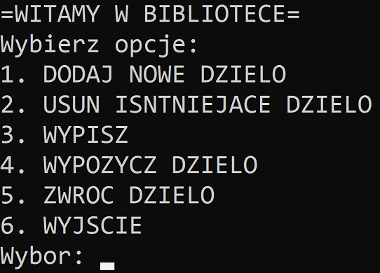
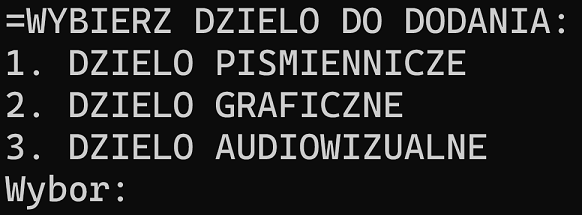
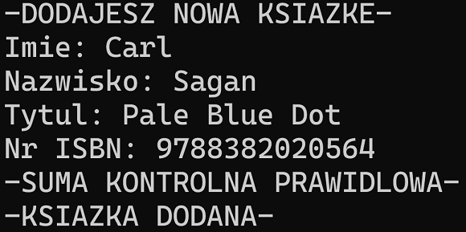
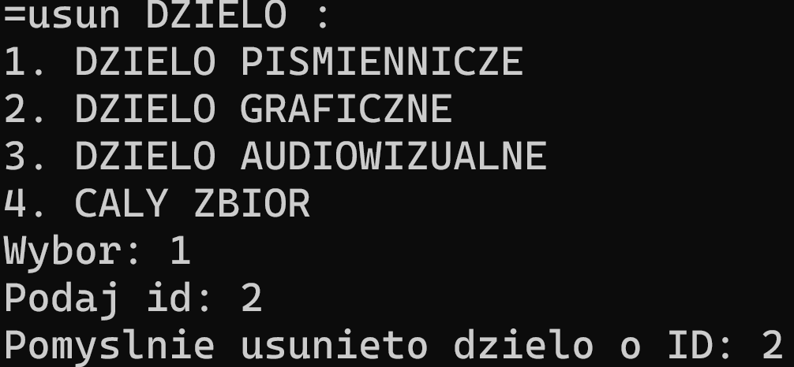

# Library management system

This is a console application that allows users to manage a library. Program was written entirely in C++, with the use of OOP as a final semester project. 

## Features
The Library Management System has following features:  
&#8226; Add new books, posters or audiovisuals: User can add new items to the library by entering their details, such as title, author and more depending on actually selected work type (ISBN number, width and height, duration).  
&#8226; Unique ID assignment: System automatically assigns a unique ID to each new item that is added to the library.   
&#8226; Borrow, return, or delete existing works from library collection: User can borrow, return or delete items by entering their unique ID.  
&#8226; ISBN-13 checksum: Program implements the checksum algorythm that ensures the given ISBN number is valid.  
&#8226; Displaying library collection: Allows user to display existing items with their details and availability status.
## Example of use
After running program the option selection menu is displayed. User can choose one of the options:   
  
  

When option is selected by user, program asks to choose type of work:  
  
  
  
In this example, a book is added, and then removed. User must provide author's name, title and ISBN number.  
  
  
  
If ISBN number is valid, book is added. After that option selection menu is displayed again.  
In order to delete existing work user must first choose it's type and provide unique ID assigned to the work. If ID doesn't match any work, relevant information is displayed.  
  
  
